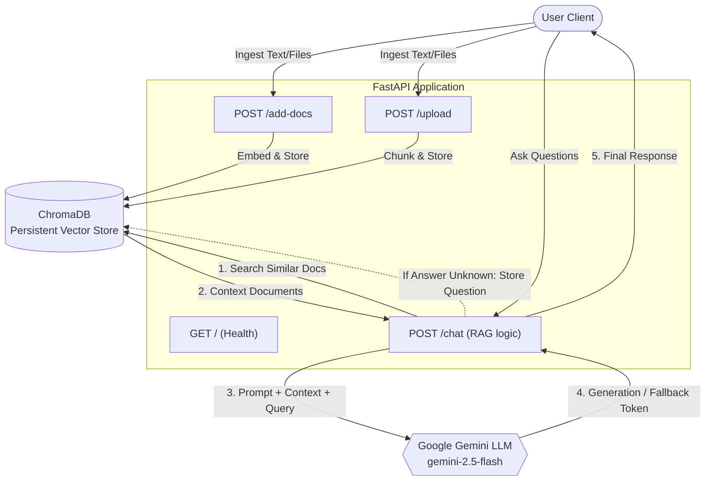

# RAG API (Chroma + Gemini) 🚀

This repository hosts a Retrieval-Augmented Generation (RAG) system built with FastAPI, ChromaDB, and Google Gemini. The system ingest documents and answers user queries strictly based on the provided context, implementing intelligent fallback mechanisms for unrelated or unanswered questions.

## 🏛️ Architecture

The system follows a typical RAG design pattern connecting users, vector database, and the LLM via a FastAPI backend service.



### Key Components

1. **FastAPI Backend (`main.py`)**: The central routing logic handling API requests.
2. **ChromaDB (`./chroma_db`)**: A persistent local vector store where embedded documents (context) are saved to quickly extract semantic matches during a user query.
3. **Google Gemini (`gemini-2.5-flash`)**: Used for generating high-quality context-aware responses and determining if a user's question aligns with the supplied knowledge base.

---

## 🔄 Core Workflows

### 1. Data Ingestion
Documents can be ingested either as plain text slices `POST /add-docs` or file uploads `POST /upload`. Chunking is performed prior to entering the text into ChromaDB, which automatically handles token embedding.

### 2. Retrieval & Generation (RAG)
When a user queries the `POST /chat` endpoint:
- **Retrieval**: The system queries ChromaDB (`n_results=3` by default) for the most relevant context documents.
- **Prompt Engineering**: Instructs Gemini to:
  1. Determine if the question belongs to the target domain.
  2. Answer strictly using the context.
- **Generation**: Gemini generates the response or explicitly returns predetermined fallback tokens (`UNRELATED_QUESTION` or `UNKNOWN_RELATED_QUESTION`).

### 3. Smart Fallbacks
- **Out of Scope (Unrelated)**: If the question is outside the expected domain space, the application gracefully rejects it.
- **In Scope but Unknown**: If the question applies to the business but there is insufficient context to provide an accurate answer, the system politely declines and **automatically stores the unanswered question** in ChromaDB to improve the RAG dataset moving forward.

---

## 🚀 Setup & Installation

### Environment Configuration
Ensure you have Python 3.10+ installed.

1. Create a `virtualenv` and install requirements:
```bash
python -m venv venv
source venv/bin/activate  # Or `venv\Scripts\activate` on Windows
pip install -r requirements.txt
```

2. Create a `.env` file in the root directory and add your Google Gemini API key:
```env
GEMINI_API_KEY="your_actual_api_key_here"
```

### Running the Application

Start the local Uvicorn development server:
```bash
uvicorn main:app --reload
```

The API will be accessible at: `http://127.0.0.1:8000`. You can test endpoints openly using the Swagger UI at `http://127.0.0.1:8000/docs`.

---

## 🧪 Testing and CI

An extensive Pytest testing suite mocks internal ChromaDB and Gemini functions to ensure endpoint reliability without mutating real databases and eating up LLM quota.

To run tests manually:
```bash
pytest test_main.py
```

A `.github/workflows/ci.yml` is provided for automated testing on every push and pull request to the `main` branch.
